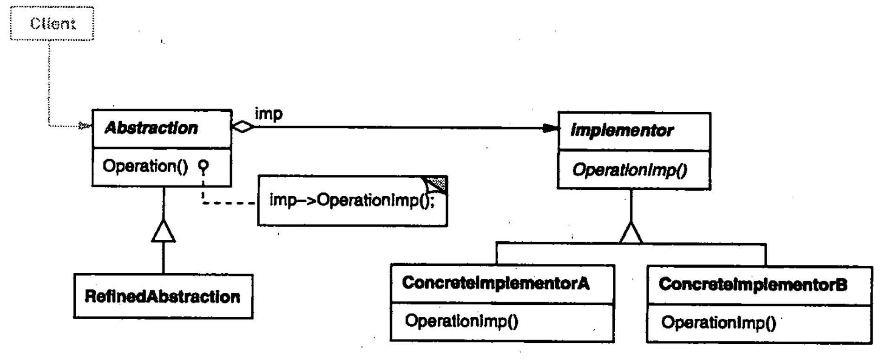

# Bridge

## Intent

将 `抽象部分` 与它的 `实现部分` 分离，使他们可以独立地变化。
(非编程语言中的 抽象与实现 概念)

## Motivation

当一个抽象可能有多个实现时，通常用继承来协调它们。抽象类定义对改抽象的接口，而具体的子类则用不同方式实现。
但是此方法有时不够灵活。
继承机制将抽象部分与它的实现部分固定在一起，使得难以对抽象部分和实现部分独立地进行修改，扩充和复用。

## Applicability
以下情况下使用Bridge模式：
- 你不希望在`抽象`和`它的实现`部分之间有一个**固定**的绑定关系。例如，这种情况可能是因为，在程序运行时实现部分应可以被选择或者切换。
- 类的抽象以及它的实现都应该可以通过生成子类的方法加以扩充。这时Bridge模式使你可以对不同的抽象接口和实现部分进行组合，并分别对它们进行扩充。
- 对一个抽象的实现部分的修改应对客户不产生影响，即客户代码不必重新编译。
- 正如在意图一节的第一个类图中所示的那样，有许多类要生成。这样一种类层次结构说明你必须将一个对象分解成两个部分。
- 你想在多个对象间共享实现，但是同时要求客户并不知道这一点。

## 结构

## 参与者

* Abstraction
  * 定义抽象类的接口
  * 维护一个指向Implementor类型对象的指针
* RefinedAbstraction
  * 扩充由Abstraction定义的接口
* Implementor
  * 定义实现类的接口，该接口不一定要与Abstraction的接口完全一致；事实上这两个接口可以完全不同。一般来讲，Implementor接口仅提供基本操作，而Abstraction这定义了基于这些基本操作的较高层次的操作。
* ConcreteImplementor
  * 实现Implementor接口并定义它的具体实现。

## 协作
* Abstraction 将 client的请求转发给它的Implementor对象

## 效果
优点：
* 分离接口与其实现部分
* 提高可扩充性
* 实现细节对客户透明

## 实现
* 仅有一个Implementor

* 创建正确的Implementor对象
  * 但存在多个Implementor类的时候，你应该用何种方法，在何时何处确定创建哪一个Implementor类呢？
    * 如果Abstraction知道所有的ConcreteImplementor类，它就可以在它的构造器中对其中的一个类进行实例化，它可以通过传递给构造器的参数确定实例化哪一个类。例如，如果一个collection类支持多重实现，就可以根据collection的大小决定实例化哪一个类。链表的实现可以用于较小的collection类，而hash表则可用于较大的collection类。