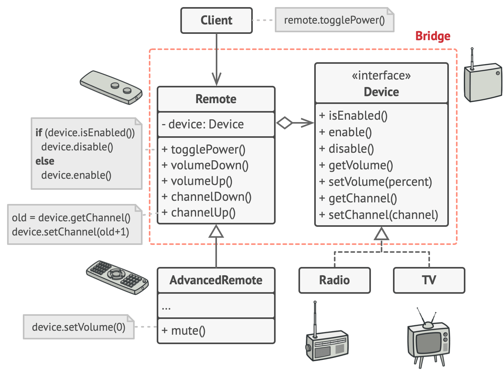

# Remote and Device

This example illustrates how the `Bridge` pattern can help divide the monolithic code of an app that manages devices and their remote controls. 
The Device classes act as the `implementation`, 
whereas the Remotes act as the `abstraction`.

The base remote control class declares `a reference field` that links it with a device object. 
All remotes work with the devices via the general device interface, 
which lets the same remote support multiple device types.

You can **develop the remote control classes independently from the device classes.** 
All that’s needed is to create a new remote subclass. 
For example, a basic remote control might only have two buttons, 
but you could extend it with additional features, such as an extra battery or a touchscreen.

The client code links the desired type of remote control with a specific device object via the remote’s constructor.

